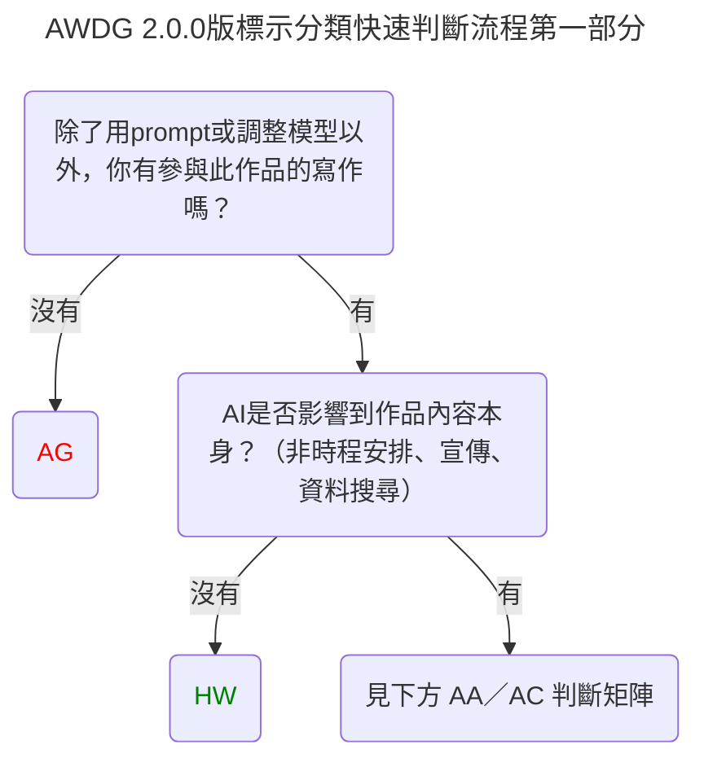

# 人工智能寫作揭露準則（AWDG） 

AI Writing Disclosure Guidelines (AWDG)

> v2.0.0
> 
> 
 
 重大更新

>
> - 限定了以 hashtag 作為標示方法時的標籤格式
> - 修正了 AA、AC 之間隱含上下關係的潛在疑慮
> 	- 更新了兩步驟快速判斷流程
> 	- 修正了分類說明的「僅」、「程度」等字詞
> 	- 現在 AA、AC 可在同層級同時出現
> 	- AA、AC 不再是程度上的差異，而是獨立判斷的兩種依據
> 	- 在進一步說明增加了三則 AA、AC 出現的情境範例
> 	- 增加了一則使用範例
> - 將資料搜尋、歷史背景調查等排除於 AI 寫作的範圍
> - 進一步說明了 AG 的分枝選擇寫作
> - 修正了會產生誤解的字詞
> 
> 

> 
 
 修訂

> 
> - 更正錯字
> - 更正錯誤的標點符號
> - 統一部分用詞
> 
> 

>
> Huang, Tin-Hian  
> 2026-09-11  
> #AWDG_AC （本文件依 AWDG 自我揭露）

---

1. AWDG 是什麼？

    人工智能寫作揭露準則（AWDG），是一項寫作社群自發採用的建議原則。用以建立作者與讀者、徵稿者對使用 AI 寫作程度的參考定義。

2. 我是作者，怎麼用 AWDG？

    根據以下 AWDG 對 AI 寫作方式的分類，自行判斷寫作過程屬於哪一類，並在發表時於合適的地方，標明 AWDG_[英文縮寫]。四大類的標示要素（指定色、中文名、英文解釋）可自選採用，以向讀者或徵稿者揭露自己如何使用了 AI 。以下為三則使用範例：
	
> [!TIP]
> 本文章AI使用： #AWDG_AC(AI-Consulted)

> [!TIP]
>本專欄符合 AWDG_HW 無使用AI

> [!TIP]
>《文章標題》 #AWDG_AC_AA

3. 我是徵稿者，怎麼用 AWDG？

    根據本文件下方的創用CC 授權，不須知會條文編寫者，可自行改寫、轉載此條文至徵稿辦法。須註明「AWDG」 及附上本文連結。
    （如需引用特定版本條文，請參照 GitHub Releases 頁面）

4. 用 AWDG 意味著什麼？

    AWDG 參考了學術寫作中對 AI 使用主動揭露、誠實負責的精神。使用 AWDG 意味著您和其他使用者共享這一套對 AI 寫作的定義，能幫助其他人快速初步理解您如何使用 AI 寫作。

5.  AWDG 是針對寫作提供的指引，參考理論屬於語言、文本和自然語言生成的領域，因此並不包含，也不建議推廣至繪畫、影像、音樂等等領域應用。

---
## 標示
### 快速判斷流程
#### 第一部分：AI 是否涉及參與

#### 第二部分：AA／AC 判斷矩陣
| ↓ AA 軸／AC 軸 → | AI **有**參與構思、回饋 | AI **沒有**參與構思、回饋 |
|---|---|---|
| **有**貼上或改寫 AI 生成的文字 | AC 和 AA | AA |
| **沒有**貼上或改寫 AI 生成的文字 | AC | （不會出現，回到 HW 判斷） |

### 分類和說明
- [AG] -紅- 純 AI 執筆，未經編修（AI-Generated）

  僅使用 prompt 或以上（參數設定、模型訓練、超參數調整）層級之方式生成文字，且無手動（即以前述以外之方式）更改任何一處的作品。注意此分類的要求是嚴格的，與其他分類並非程度上的差異。[^1]
- [AA] -橘- 含有 AI 產生的內容（AI-Assisted）

    寫作過程中，有使用生成式AI提供之文字內容，或使用程度幾乎達到複製—貼上的方式，包括但不限於改寫 AI 生成的句子，以及請 AI 改錯字、梳理語句後，直接以 AI 生成的版本為最終作品。

- [AC] -黃- AI協力／與 AI 合作（AI-Consulted）

  寫作過程中，有使用生成式 AI 進行構思、評價回饋等方式，但未直接使用 AI 提供的內容。腦力激盪、章節安排、大綱草擬、意見回饋等應屬此類。角色設定、世界觀設定等，因為對作品內容有所影響，也應當視為有 AI 協力。

- [HW] -綠- 無使用AI（Human-Written）

  寫作過程中完全無使用 AI 。或僅使用於安排時程規劃、周邊宣傳等跟作品本身無關之方面。書本之封面、宣傳圖等，由於不屬於文字創作，因此不在 AWDG 的適用範圍內。而宣傳文案本身，應視為與內容獨立之不同文本，標示相應的標籤。

### 進一步說明
- AA 和 AC 標示在同一層級（篇／章／段）、同一段文本**可以並存**，應視為獨立的兩軸，並不互斥。如：
	- 一個章節在構思時曾與 AI 討論，落筆時由人類寫作者逐字逐句完成，則章節標示 AC。
	- 一個章節由人類寫作者構思，但寫作過程局部有使用 AI 生成的句子或字詞排列，則章節應標示 AA。
	- 一個章節在發想時，AI 曾提供意見，而人類寫作後，也有使用一些 AI 的表述。則章節同時有 AC 和 AA。
	- 同時標示時，**AC 在前，AA 在後，中間以底線連結。格式為 AWDG_AC_AA。**
- 使用 AI 校對、改錯字。若在生成式 AI 輸出正確版本以後，直接複製 AI 生成的版本做為作品，即屬於 AA。若使 AI 指出錯誤的地方，由人類手動更改文檔的少數錯誤，則可屬 AC。
- AG 分類在從屬層級上是嚴格的。譬如，若一篇文章要標示為 AG ，則該文章必須是以下三者中的一種，否則，應當標示為 AA，或者逐段標示。
	- 由同一則訊息內的段落組成（如迭代生成）
	- 由同一段對話裡的連續訊息組成（如接龍生成）
	- 使用 prompt 或模型的 features 對 AI 提供的寫作版本進行分枝選擇（如果在模型外，自行選擇了分枝版本，應視為 AA）
- 使用 AI 工具進行資料搜尋、歷史背景調查等，由於現今之搜尋引擎、圖書館電子搜尋功能均有機會配備AI搜尋功能，難以避免，且難以舉證，因此排除在 AI 寫作之外（即，可標示為 HW）。惟寫作者判定其使用 AI 的資料組合過於特殊、稀有時，可標示 AC。
	- 若查詢資料的過程中涉及非法入侵資料庫、侵占或侵權，屬法律層面與道德判斷，不影響 AWDG 標示。

---
## 須知
1. AWDG 是一個通用準則，無中心組織，因此並不是認證標章。使用 AWDG 之寫作者，應妥善保留與 AI 對話之記錄、模型版本、偏好設定等資料，以供日後作為證明。[^2]
2. AWDG 是描述人類寫作者如何使用 AI 工具寫作的簡潔方式，它並不暗示人類寫作者對此作品的貢獻度，也不暗示著作權的所屬對象。
	- 例如，AG 分類的作品，雖然文本均由 AI 生成，但人類寫作者可能參與模型開發、訓練、參數調整等過程，其耗費心力與難度並不一定比 HW 分類的作品少。
3. AWDG 是對文本的分類標籤，可以視發表需求決定標示層級屬於（包括但不限）段落、章節、書本內容……等層級。
	- 當對篇章進行揭露標示時，如有些段落屬於 AI 提供想法、有些段落為純 AI 生成之類的混合情況時，應標示為 AA 和 AC。不可標示為 AG。詳見 [進一步說明](#進一步說明)。或者，亦可逐段標示。

---
## AWDG 應用於文學獎的指引
### 主辦方及評審團應與不應：
1. 主辦方與評審**不應**在參賽者已使用 AWDG 進行揭露後，仍對其使用之行為進行道德譴責。
	- 主辦方與評審在參與文學獎時，**應**與參賽者之間保持互信且前後意思一致的原則。若主辦方禁止 AI 使用，應於參賽規則公告意思。而答應為該文學獎之評審，當視為同意該次的參賽規則。
	- 因此，絕不應該在徵文時要求參賽者自我接露 AI 使用行為，卻在事後將此行為視為道德問題。此項指引用意在於避免一切使用 AI 寫作的行為被汙名化。
2. 主辦方**應**於徵稿辦法明文表示，對 AWDG 行「信任申報制」或「嚴格舉證制」中的一種。
	- 信任申報制：除非投稿者公開承認，或有壓倒性證據證明，其 AWDG 標籤不符實際情況，否則不應憑懷疑、檢舉對投稿者進行事後究責或撤換名次。
		- 當具有懷疑或接獲檢舉時，要求投稿者提供資料存檔是可接受的，但對其應從寬認定，比如接受存檔遺漏少許片段或遮蔽部分隱私。
		- 除非該投稿者有明顯不符之欺騙行為，或者於投稿時說明採取 AWDG ，卻故意損毀存檔，甚至偽造存檔。
		- 若在進行補件調查時召開評審會議，事後發現投稿者沒有明顯之不當行為，則不應調整結果；會議記錄不公開，以保護投稿者。
	- 嚴格舉證制：主辦方得於初、複、決審任何一環節要求晉級者遞交對話記錄、提示詞、偏好設定、使用模型與版本等等說明資料。或在得獎名單產生後，對無法提供資料者，資料內容不符、矛盾者採取消資格的處置。
### 主辦方及評審團可以：
1. 在徵稿階段，明定某類 AI 使用不屬於徵稿範圍。
2. 在徵稿階段，要求參賽者於報名表以 AWDG 建議之四個類別，標明自己的使用程度。
3. 在徵稿階段，直接參考 AWDG 建議的四個類別，進行分組、分類比賽。
4. 在對其揭露程度的真實性有疑慮時，要求參賽者提供與 AI 對話之記錄（HW級別者，可要求提供每階段存檔，或速記草稿等資料）
	- 此項指引用意在於維持 AWDG 可運作，而非僅有無證據力的表面承諾。AWDG 是為維持多方對於使用 AI 寫作的程度有共同定義，而非讓寫作者對作品卸責。
	- 但參賽者與 AI 的對話記錄、參數、偏好設定，也屬於部分隱私。故主辦方與評審團在取得資料後，是否要對大眾公開，應有進一步於公益的理由。
5. AWDG 無可避免地會影響評審對名次的判斷。要在何階段將 AWDG 納入評審知情範圍，保留主辦方與評審團的決定空間。
---
本文件採用 [CC BY-SA 4.0](https://creativecommons.org/licenses/by-sa/4.0/deed.zh-hant) 授權，轉載請標示「AWDG」並附上[本文連結](https://github.com/tin2hian5/AI-Writing-Disclosure-Guidelines)。

[^1]: 此分類之所以要求嚴格，在於保護詠唱寫作（prompting） 的發展。

[^2]: 保留方式與檔案格式，可參考現有網路教學資源。
